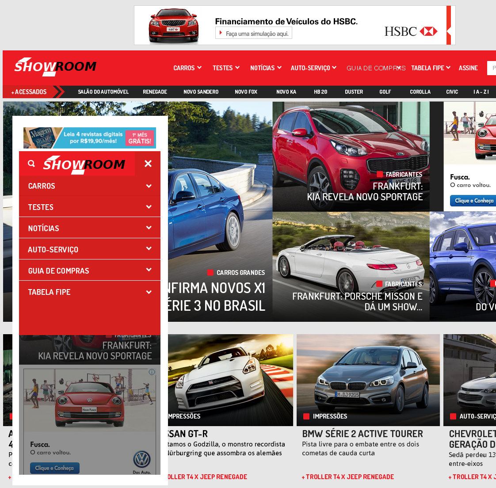

# SHOWROOM-WP
======

Multi-porpouse wordpress layout

Tema de WordPress responstivo, com menu multi-nível, para várias finalidades, desenvolvido com foco em cliente revista de automóvel. Tema de código aberto disponível em: github repositório oficial

Author: Francisco Matelli Matulovic

Locale: Itapetininga, Sao Paulo

Data: 16/03/2016

Site: www.franciscomat.com | www.franciscomat.com.br

====

Thanks to:

http://www.sitepoint.com/create-a-wordpress-theme-settings-page-with-the-settings-api/
